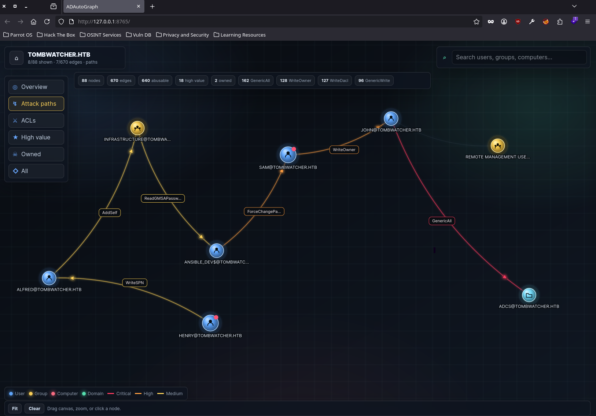

<div align="center">

```
 █████╗ ██████╗       ██████╗ ██████╗  █████╗ ██████╗ ██╗  ██╗
██╔══██╗██╔══██╗     ██╔════╝ ██╔══██╗██╔══██╗██╔══██╗██║  ██║
███████║██║  ██║     ██║  ███╗██████╔╝███████║██████╔╝███████║
██╔══██║██║  ██║     ██║   ██║██╔══██╗██╔══██║██╔═══╝ ██╔══██║
██║  ██║██████╔╝     ╚██████╔╝██║  ██║██║  ██║██║     ██║  ██║
╚═╝  ╚═╝╚═════╝       ╚═════╝ ╚═╝  ╚═╝╚═╝  ╚═╝╚═╝     ╚═╝  ╚═╝
        Active Directory · attack-path graph · operator-first
```

# 🕸️ ADAutoGraph

**A modern, local, BloodHound-style attack-path graph for Active Directory.**

Import a BloodHound collector ZIP, explore AD relationships through a clean, fast,
operator-focused web UI, and walk the abuse paths to Domain Admin — all offline,
no Node, no Docker, **pure Python standard library**.

<sub>Crafted & weaponized by **c4sh3r** · authorized engagements only · companion to [⚡ ADAutoPwn](https://github.com/C4sh3R/ADAutoPwn)</sub>


-2ea44f?style=flat-square&logo=python&logoColor=white)


[](https://www.buymeacoffee.com/C4sh3R)

</div>

---

## 🖼️ Preview



---

## ✨ Why ADAutoGraph?

BloodHound is excellent — but sometimes you just want a **lightweight local viewer**
that opens instantly, doesn't dump 5,000 nodes on screen at once, keeps one
engagement isolated, highlights the abuse paths with ready-to-run commands, and
feels native to an offensive workflow.

That's ADAutoGraph. You import a BloodHound ZIP, pick a domain, and build the
visible graph **progressively** — from searches, focused object actions, ACL
views, or full attack paths. Mark what you own, and it draws the chain to Domain
Admin for you.

It's the graphical companion to **[⚡ ADAutoPwn](https://github.com/C4sh3R/ADAutoPwn)**:
that tool can launch ADAutoGraph automatically at the end of a run, import the
freshly-collected BloodHound data, and **pre-mark every principal it already
compromised as `owned`** — so the path lights up the moment the browser opens.

> ⚠️ **Legal:** Use only against systems you are explicitly authorized to test —
> your own lab, a CTF, or a signed engagement. You are responsible for your actions.

---

## 🚀 Features

| Area | What you get |
|-----:|--------------|
| **Import** | BloodHound collector ZIPs → normalized users, groups, computers, domains, OUs, GPOs, containers and **ACL edges**, stored in `data/graph.db` (SQLite) |
| **Multi-domain** | A domain/project selector — import many datasets, keep each isolated, switch freely |
| **Progressive graph** | Starts **empty**; build only the context you need via search / views / object actions — huge datasets stay readable |
| **Modern canvas** | Deterministic static layout (no force physics, no magnetic drift), per-node drag, directional arrows (who controls whom), edge labels baked into the line and **colored by severity** |
| **Severity-aware ACLs** | 🔴 Critical (`DCSync`, `GenericAll`, `WriteDACL`, `GetChangesAll`) · 🟠 High (`WriteOwner`, `Owns`, `ForceChangePassword`, Shadow Credentials) · 🟡 Medium (`WriteSPN`, `AddMember`, `ReadGMSAPassword`, delegation) |
| **Views** | `Overview` · `Attack paths` · `ACLs` · `High value` · `Owned` · `All` — one click each |
| **Object inspector** | Full imported properties, **outbound + inbound** edges, abuse-focused edge list, raw property view |
| **Attack-path builder** | Mark objects as `owned` → it traverses abuse edges + group membership to **high-value targets**, and falls back to the best reachable chain when there's no clean DA route |
| **Command snippets** | Per-edge **Linux *and* Windows** abuse commands, color-coded, with a copy button |
| **Owned, your way** | Toggle owned in the UI **or** pre-seed it on import (used by ADAutoPwn) |

---

## 🔗 ADAutoPwn integration

ADAutoGraph is built to drop into the **[ADAutoPwn](https://github.com/C4sh3R/ADAutoPwn)** workflow:

- ADAutoPwn **auto-launches** the server at the end of a run, **imports** the
  BloodHound zip, **pre-marks owned** principals, and **opens your browser** — no
  manual steps. (`--no-web` to disable, `--web-port` to change the port.)
- Visualize any run's data on demand, even standalone:
  ```bash
  adautopwn --graph /path/to/bloodhound.zip -d corp.local --web
  ```
- If you cloned ADAutoGraph next to ADAutoPwn (or set `ADAUTOGRAPH_DIR`),
  ADAutoPwn finds it automatically. `install.sh` over there clones it for you and
  puts `adautograph` on your `PATH`.

---

## 📦 Installation

```bash
git clone https://github.com/C4sh3R/ADAutoGraph.git
cd ADAutoGraph
chmod +x server.py
```

No `pip install`, no Node, no Docker — it only uses the Python **standard library**
(`3.10+`). That's it.

### Run it from anywhere

```bash
ln -sf "$PWD/server.py" ~/.local/bin/adautograph   # ~/.local/bin is on PATH
# now just:  adautograph
```

`server.py` resolves its own directory, so the symlink works from anywhere.
(ADAutoPwn's `install.sh` also clones ADAutoGraph and creates this symlink for you.)

---

## 💻 Usage

```bash
adautograph                      # or:  python3 -B server.py
# → ADAutoGraph listening on http://127.0.0.1:8765
```

Then in the browser:

1. **Import** a BloodHound `.zip`.
2. **Open** the imported domain.
3. **Search** for a user, group, computer or domain object.
4. **Click** a node to inspect its properties, edges and abuse commands.
5. **Mark** compromised objects as `owned` (right panel).
6. Hit **Attack paths** to draw the chain from what you own to Domain Admin.

### CLI options

```bash
adautograph --host 127.0.0.1 --port 8765
```

| Option | Description | Default |
|--------|-------------|---------|
| `--host` | Bind address | `127.0.0.1` |
| `--port` | HTTP port | `8765` |

---

## 🔌 HTTP API

Small JSON API (handy for scripting / tooling like ADAutoPwn):

| Method & path | Purpose |
|---------------|---------|
| `POST /api/import` | Multipart upload: `zip` (BloodHound zip), optional `name`, optional **`owned`** (names/SIDs, separated by spaces/commas/newlines → pre-marked owned) |
| `GET /api/domains` | List imported domains (id, name, counts) |
| `GET /api/domain/<id>/graph` | Graph payload for a view (`?view=…&q=…&focus=…`) |
| `GET /api/domain/<id>/search?q=` | Search nodes |
| `GET /api/domain/<id>/stats` | Node/edge stats |
| `GET /api/domain/<id>/node/<sid>` | Full object + edges |
| `POST /api/domain/<id>/owned/<sid>` | Toggle a node's `owned` flag |

```bash
# import a zip and pre-mark owned principals in one shot
curl -F "zip=@bloodhound.zip" -F "name=corp.local" \
     -F "owned=jdoe,svc_sql,DC01\$" http://127.0.0.1:8765/api/import
```

---

## 📂 Project layout

```text
ADAutoGraph/
├── server.py            # the whole backend (stdlib http.server + sqlite3)
├── web/
│   ├── index.html
│   ├── style.css
│   └── app.js           # the canvas renderer + UI
├── data/
│   └── graph.db         # imported data — local only, git-ignored (delete to reset)
├── assets/screenshot.png
├── requirements.txt
├── LICENSE
└── README.md
```

---

## ☕ Support the project

ADAutoGraph is free and source-available (noncommercial), built on a lot of late
nights. If it made an engagement smoother or helped you learn, consider buying me
a coffee — it directly fuels the next feature. 🙏

<div align="center">

[](https://www.buymeacoffee.com/C4sh3R)

**→ https://www.buymeacoffee.com/C4sh3R**

</div>

---

## 🤝 Contributing

PRs and issues are very welcome — the AD graph space has endless room to grow.

```bash
git clone https://github.com/<you>/ADAutoGraph.git && cd ADAutoGraph
git checkout -b feature/my-idea
# hack on server.py (backend) or web/app.js (renderer) — keep it stdlib-only
python3 -c "import ast; ast.parse(open('server.py').read())"   # must stay clean
git commit -am "feat: my idea" && git push origin feature/my-idea
```

### 🌱 Good first issues

- More abuse-command recipes per edge (Linux + Windows).
- Session / `AdminTo` / `CanRDP` lateral edges in the attack-path traversal.
- Export the current graph (PNG / JSON).
- Saved layouts per domain.
- Dark / light themes.

> Test against a lab or a box you're allowed to use, and **never commit loot**
> (the `.gitignore` already blocks `data/*.db` and uploads).

---

## 📝 Notes

ADAutoGraph is **not** a replacement for the official BloodHound / BloodHound
Enterprise. It's a lightweight local viewer focused on offensive workflow, abuse
readability and fast inspection — and on pairing tightly with ADAutoPwn.

---

## 📜 License

**PolyForm Noncommercial 1.0.0** — see [`LICENSE`](LICENSE). Free to use, modify
and share for **noncommercial** purposes (research, education, personal use,
nonprofits). **Commercial use, selling or reselling is not permitted** — all
commercial rights are reserved by the author (**c4sh3r**). Provided for
**authorized security testing only**; the author assumes no liability for misuse.

<div align="center">
<sub>Made with ☕ by <b>c4sh3r</b> · companion to <a href="https://github.com/C4sh3R/ADAutoPwn">⚡ ADAutoPwn</a></sub>
</div>
